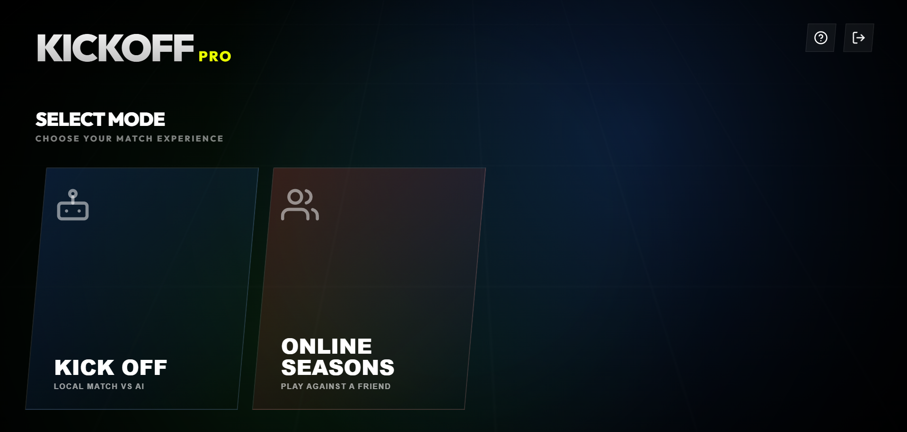
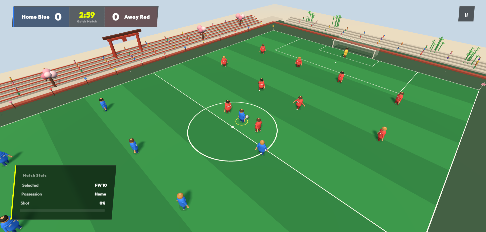

<div align="center">

# Soccer 11v11 Football

An arcade-style 3D football game built with Three.js, TypeScript, and Vite.

- more to come !!! soon :)



</div>

## Overview

Soccer 11v11 Football is a browser-based match experience with a full 3D pitch, animated players, ball possession, passing, shooting, tackling, goalkeeper behavior, and an optional online 1v1 mode.

The game opens with a stylized KICKOFF PRO menu and supports both local matches against AI and peer-to-peer matches with a friend.

## Features

- 3D 11v11 football pitch rendered with Three.js
- Local match against an AI-controlled opposing team
- Online 1v1 sessions using PeerJS
- Host or join a match with a short room code
- Passing, through balls, charged shots, sprinting, tackling, and player switching
- Ball possession, goals, kickoff restarts, match clock, score display, and pause flow
- Responsive HUD and menu layouts for desktop and mobile screens
- Sakura brick-world environment surrounding the pitch
- Playwright render checks for desktop and mobile canvas framing

## Preview

### Main menu


### Match gameplay




## Controls

| Action | Keyboard |
| --- | --- |
| Move | `W` `A` `S` `D` |
| Sprint | `Shift` |
| Pass | `J` |
| Through ball | `K` |
| Shoot | Hold `Space`, then release |
| Tackle | `I` |
| Switch player | `Q` |
| Pause / resume | `Esc` |

## Online matches

1. Select **ONLINE SEASONS** from the main menu.
2. Choose **CREATE SESSION** to host a match.
3. Share the generated room code with your opponent.
4. The other player enters the code and selects **CONNECT**.

Online play uses PeerJS for browser-to-browser communication. Both players need an active network connection and compatible browser support for WebRTC.

## Project structure

```text
src/
	core/          Camera, input, networking, and game orchestration
	entities/      Ball, player, and team models
	environment/   Pitch and surrounding 3D world
	systems/       Match simulation and gameplay rules
	ui/            Main menu, HUD, and pause menu
public/preview/  README preview images
tests/           Playwright render checks
```

## Technology

- TypeScript
- Three.js
- Vite
- PeerJS
- Playwright

## License

This project is private and intended for development and demonstration purposes.
